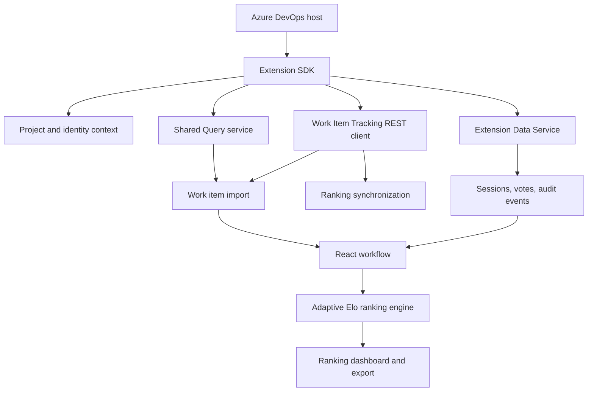

# Architecture

Adaptive Feature Prioritization is a client-only Azure DevOps Marketplace extension. It has no backend, database, storage account, or external API, which keeps recurring cloud cost at zero.

## Boundaries

- `src/models`: typed work items, sessions, votes, rankings, roles, shared query nodes, and session configuration.
- `src/services/azureContext`: host initialization, current project detection, live import, and local fallback.
- `src/services/azureDevOpsService`: WIQL query, work item field mapping, and explicit ranking write-back (`Custom.EloPriorityScore`, `Custom.EloPriorityRank`, `Elo-Rank-N` tags).
- `src/services/sharedQueryService`: recursive Shared Query listing, search, and execution.
- `src/services/extensionDataService`: Extension Data Service session storage.
- `src/services/supportServices`: audit, permissions, and CSV export.
- `src/ranking`: independent Elo math (`elo.ts`), legacy exhaustive ranking (`index.ts`), and the adaptive comparison engine (`adaptiveEngine.ts`).
- `src/components` and `src/pages`: reserved for reusable workflow UI as the dashboard is expanded.

The current UI is deliberately usable in standalone Vite mode with demo data. In Azure DevOps, `loadAzureContext` attempts host authentication and replaces the demo list with live work items. No PAT or secret is requested or stored.

## Why adaptive instead of exhaustive pairwise

Exhaustive pairwise comparison requires `N * (N - 1) / 2` comparisons, which becomes impractical past a few dozen items. `AdaptiveEloEngine` instead selects the next comparison between items with the smallest score gap and the highest remaining uncertainty (fewest comparisons so far), and skips pairs once they have been compared twice. A session is considered complete once overall confidence reaches the configured threshold (default 90%) or the maximum comparison count is reached, whichever comes first.
